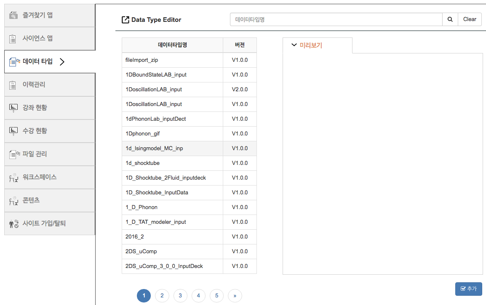

# Datatype

사이언스 앱에서 생성되는 다양한 데이터의 형태를 구분하는 요소입니다. 데이터 형태를 편집할 수 있는 편집기와 분석할 수 있는 분석기를 지정할 수 있으며, 앱을 등록하는 과정에서 입출력 포트를 생성하는 경우, 각 포트별로 데이터 타입을 지정해야 합니다. 데이터타입은 그림과 같은 구조로 도식화 할 수 있습니다.


> 예를 들어 흔히 사용하는 텍스트 파일을 하나의 데이터 타입으로 등록할 수 있습니다.
> 아래 그림은 편집기는 TEXT_EDITOR를 지정하고, 분석기는 OSPTextViewer로 설정한 ```text``` 데이터 타입을 조회한 결과 입니다.
>
> 


데이터 타입은
 해석기(Solver)의 입출력

위 그림은 사이언스 앱 구성요소 중 해석기와 데이터 타입의 구조를 나타낸 그림입니다. (a)해석기는 여러 개의 입출력 포트를 가지고 있으며, 각각의 입출력 포트는 1개의 데이터 타입을 가지게 됩니다. 데이터 타입의 경우 1개 이상의 편집기와 분석기를 가질수 있습니다. 사이언스 앱 개발자는 입출력 포트 등록 시 기존에 등록되어 있는 데이터 타입을 사용할 수 있습니다.

## Datatype 생성

My EDISON > Datatype 관리 > 추가를 통해 신규 Datatype을 생성할 수 있습니다.


