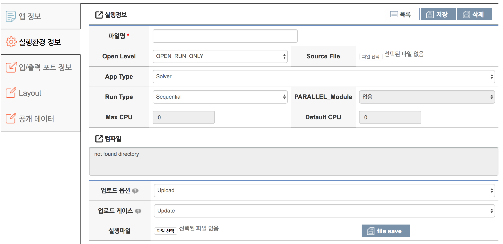

## 실행환경 정보 입력




(1) 업로드 한 실행 파일 명을 입력 이 실행파일명을 바탕으로 앱 테스트 및 시뮬레이션 실행을 하므로 틀리지 않게 작성해야 한다.실행 파일명을 파일 명으로 작성합니다.

(2) Open Level을 설정 해주는 부분 입니다. Open Level은 OPEN_RUN_ONLY와 OPEN_SOURCE, OPEN_BINARY 이면 소스 파일을 등록합니다.

|메뉴|설명|
|--|--|
|OPEN_RUN_ONLY||
|OPEN_SOURCE||
|OPEN_BINARY||
|DOWNLOAD_ONLY||
 - OPEN_RUN_ONLY : 웹상에서 시뮬레이션 실행만 원하는 경우
 - OPEN_SOURCE : 누구나 해당 앱의 소스코드를 다운 받을 수 있음. 해당 소스코드 파일을 업로드 해야 함.
 - OPEN_BINARY : 실행 파일까지 다운로드 받을 수 있도록 설정. 등록시 업로드한 실행 압축 파일을 받을 수 있음

(3) 앱의 타입을 설정합니다.  Solver, Converter 를 선택 할 수 있습니다.

(4) 앱의 실행 타입을 설정 할 수 있습니다.  실행 타입은 Sequential, Parallel 을 선택 할 수 있습니다. 앱실행 타입이 Parallel 이면 PARALLEL_Module, Max CPU, Default CPU 를 설정 부분이 활성화 되어 설정이 가능해 집니다.

(5) 앱의 타입을 설정합니다.  Solver, Converter 를 선택 할 수 있습니다.  


(6) 저장버튼을 선택하여 현재 상태를 저장 한 후 다음단계인 ‘입/출력 포트 정보 등록’ (탭 메뉴 입/출력 포트 정보)로 이동합니다.

 -  ```*``` 표시 항목은 반드시 입력해야 하는 필수 입력 값 입니다.
 - 실행환경 정보를 저장한 후 다음 단계로 이동 할 수 있습니다.
 - 실행 파일의 압축 형태는 gz, tar, zip 확장자만 가능 하며, 200MB를 초과 할 수 없습니다. 200MB를 초과하는 파일의 업로드 시에는 관리자에게 문의해야 합니다.
